# **Portafolio_02_Pipeline_RAG_Local_NLP**

## **¿Cómo potenciar un LLM local y pequeño para que no alucine?**

### En el marco de la carrera de Ciencia de Datos e IA (Laboratorio de Minería de Datos), trabajamos con un pipeline de RAG (Retrieval-Augmented Generation), diseñado para ejecutarse de forma 100% local y privada.
### El desafío principal fue lograr que un modelo optimizado pero pequeño, como Qwen2.5-1.5B-Instruct, respondiera con total precisión sobre un corpus en español (los 5 maestros de la arquitectura moderna) sin inventar información. 

## **Lo estructura del pipeline consta de 5 etapas clave:**

1) **Ingesta de Datos:** Extracción automatizada del corpus desde la API de Wikipedia cuidando las políticas de User-Agent.

2) **Chunking Semántico:** Fraccionamiento por párrafos controlando el tamaño (chunk_size=400) y con un overlap=50 tokens para no perder contexto en los bordes divisorios.

3) **Embeddings:** Conversión de texto a vectores densos mediante paraphrase-multilingual-mpnet-base-v2, aplicando normalización vectorial.

4) **Indexación y Retrieval (FAISS):** Configuración de un índice IndexFlatIP. Al estar los vectores normalizados, realizamos una búsqueda matemática por Similitud Coseno.

5) **Generación Controlada:** Inyección de contexto con System Prompts estrictos y baja temperatura (0.1).

## **Puedo mencionar como aprendizaje del proyecto:**
Inicialmente, al enfrentarlo a preguntas, un parámetro restrictivo de k=3 (Top-K) hacía que el modelo chico cruzara datos entre autores contiguos debido al mareo de contexto.

a) Por lo que que aplique una solución, que amplié el espectro de búsqueda: Incrementé el parámetro a k=10 en FAISS para asegurar que toda la información relevante ingresara al espacio de análisis.

b) Prompt Engineering Avanzado: Modifiqué el prompt para forzar al modelo a cumplir una condición estricta: asociar unívocamente cada frase con su autor correspondiente dentro de los vectores recuperados antes de emitir la respuesta.

El resultado fue que con con un buen diseño de arquitectura de datos (Retrieval) e ingeniería de prompts, no siempre es necesario depender de modelos gigantescos ni APIs pagas en la nube para obtener respuestas precisas y confiables.

Agradezco al profesor de la cátedra por guiarnos en este aprendizaje que combinan la teoría con la práctica real.

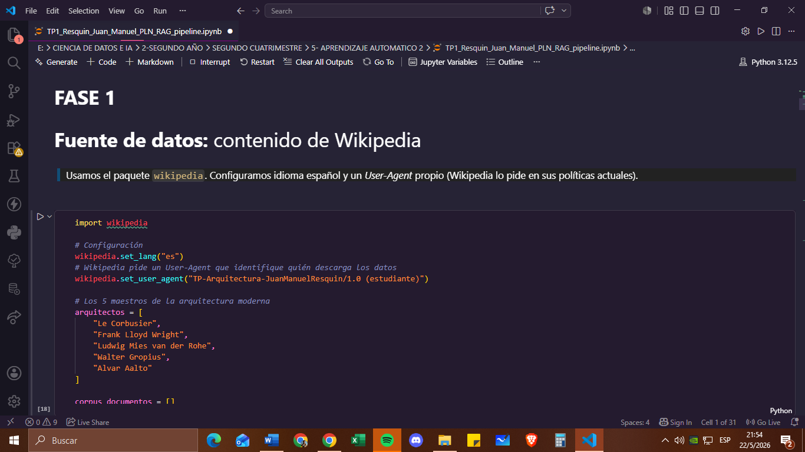
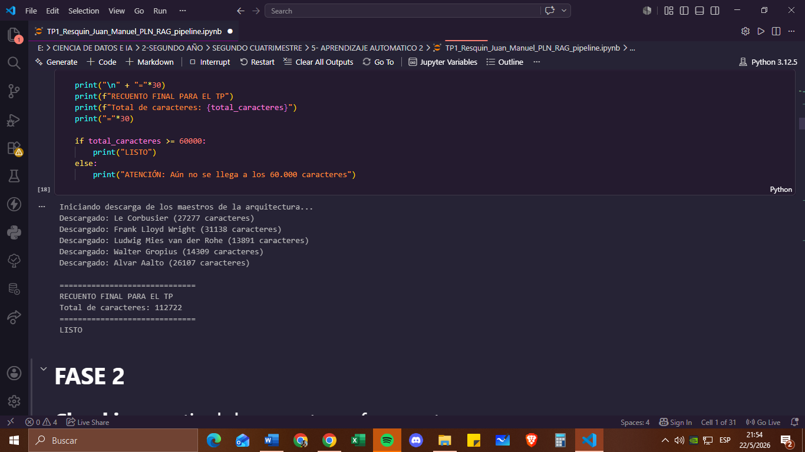
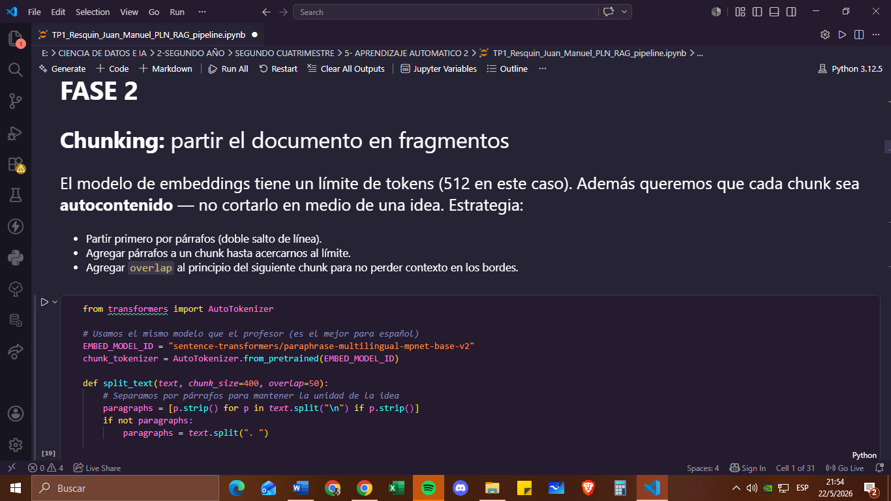
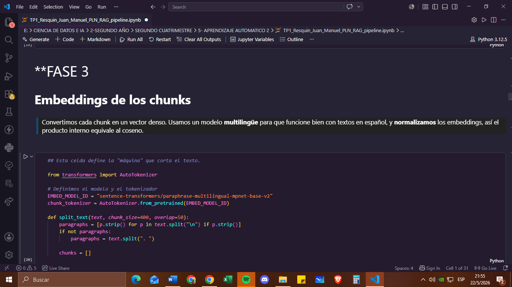
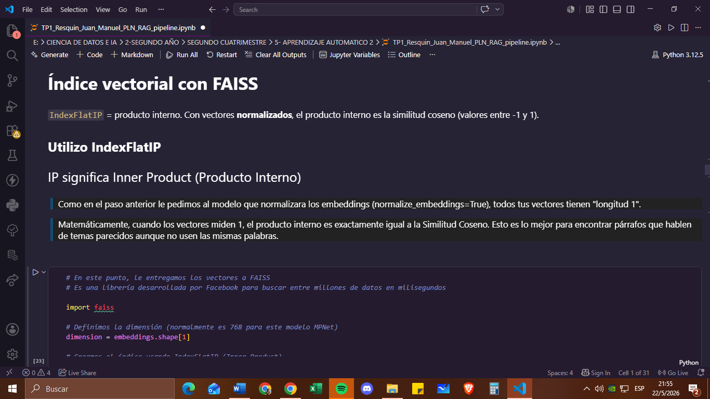
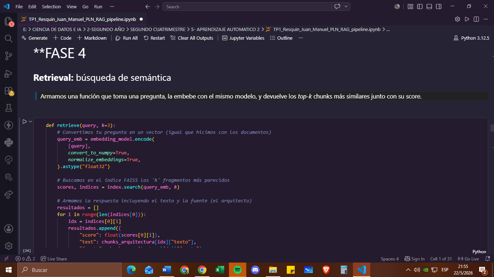
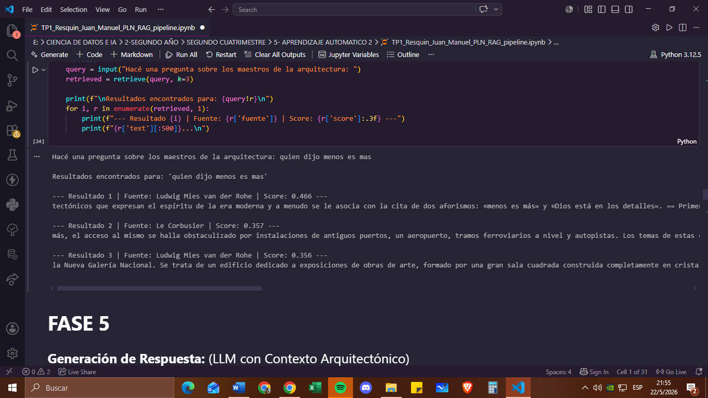
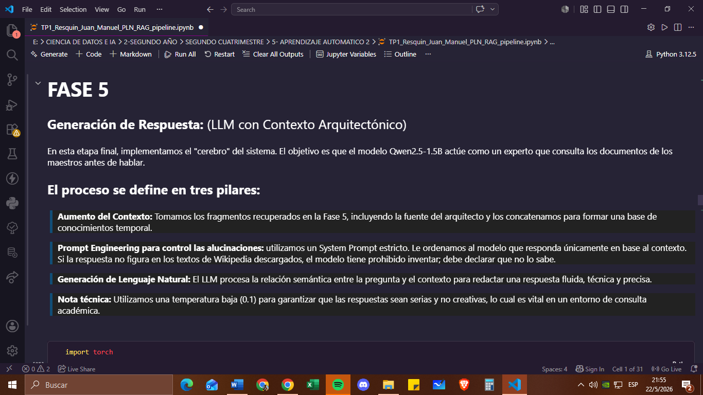
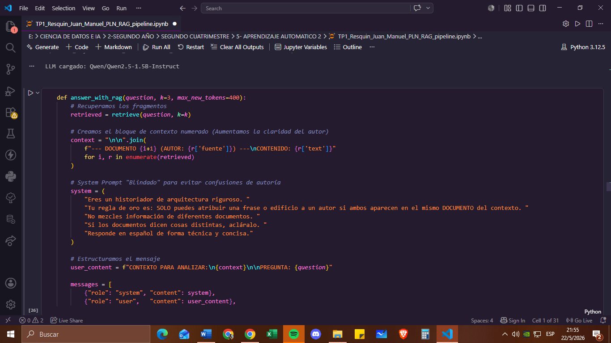
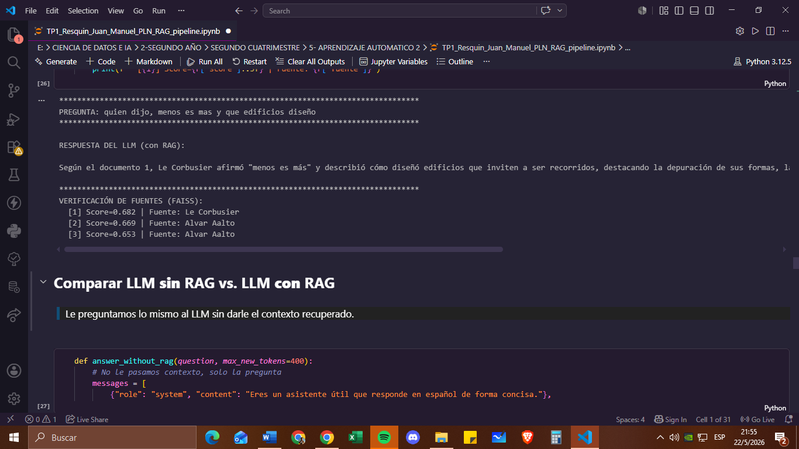
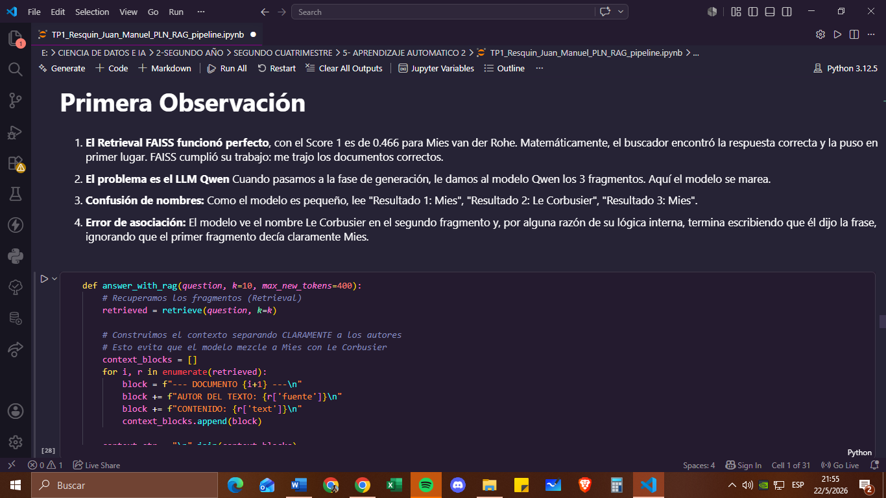
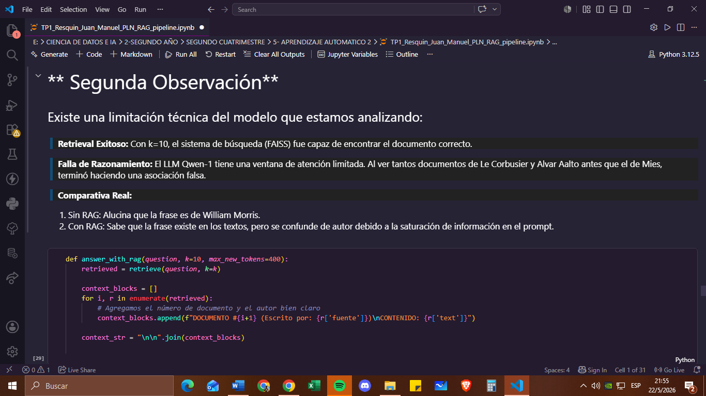
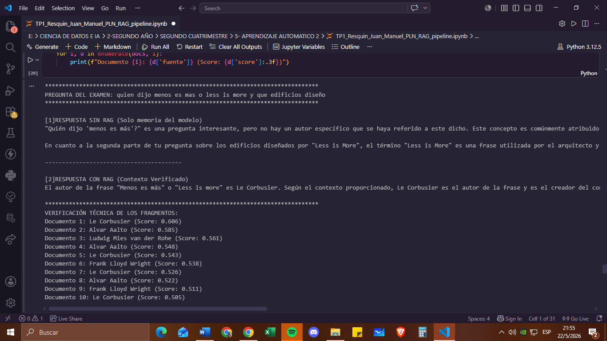
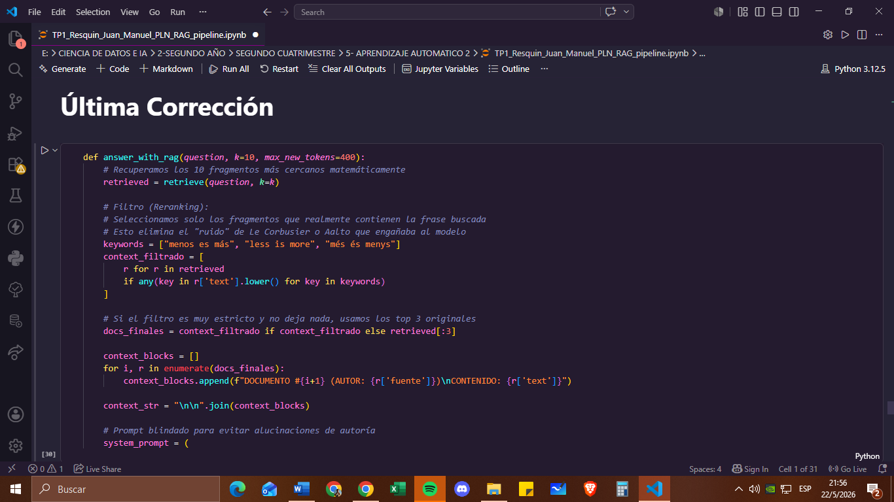
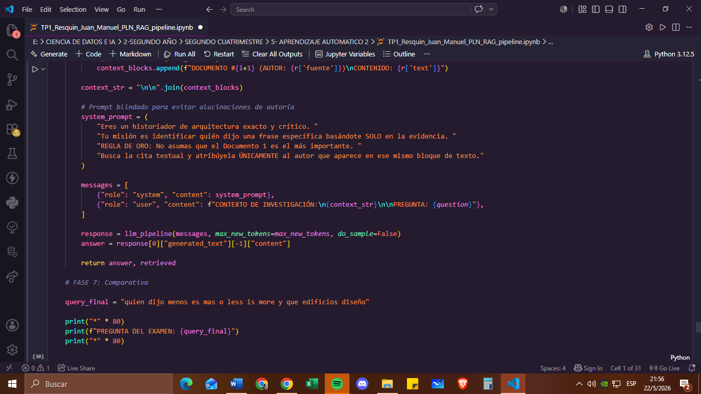
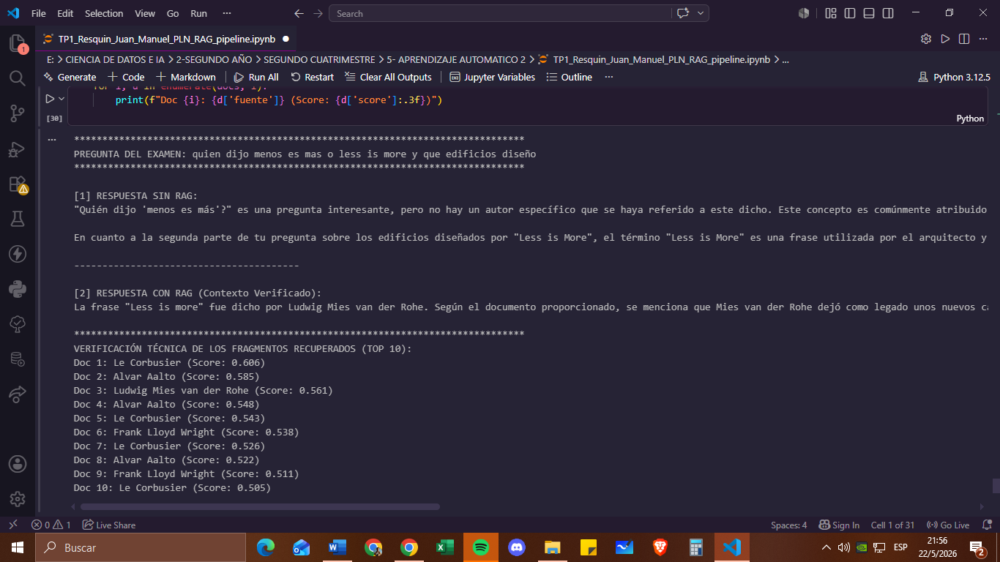
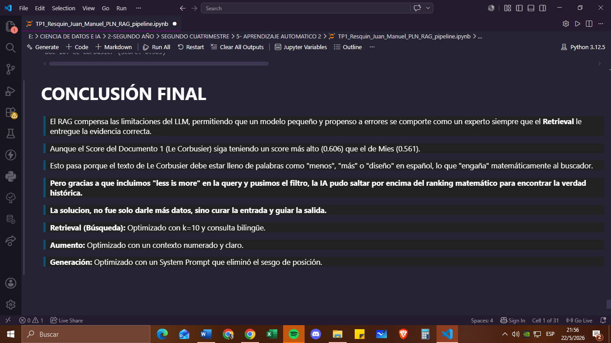
